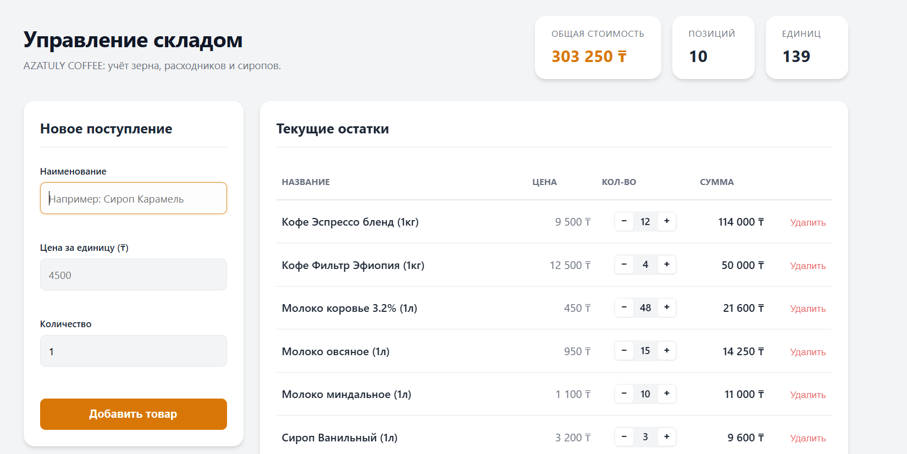

# Лабораторная 5: DOM, события, формы

Интерактивная страница склада снаряжения поверх класса Store из лабы 4 (`js-core-azatuly`). Чистый JavaScript и DOM API, без фреймворков.

**Автор:** Азатұлы Кадыр  
**Группа:** IT1-2305  
**Репозиторий:** https://github.com/azatuly/dom-store-azatuly  
**Сайт (GitHub Pages):** https://azatuly.github.io/dom-store-azatuly/

---

## Как открыть

1. **Онлайн:** Открыть ссылку на GitHub Pages выше.
2. **Локально:** Скачать репозиторий и открыть `index.html` в браузере (или запустить через расширение Live Server в VS Code).

---

## Что умеет страница

* **Список товаров из Store** отрисовывается в таблицу: название, цена, количество, сумма.
* **Форма добавления** проверяет поля и пишет ошибку под каждым полем, без `alert`: пустое название; цена пустая, не число или ≤ 0; количество пустое, не число, дробное или меньше 1. Ошибка под полем исчезает, как только его начинают исправлять.
* **Числом считается только обычная запись:** `12000`, `12 000`, `7,5`, `7.50`. Запись вроде `0x10`, `1e3` или `+3` — ошибка, хотя `Number()` принял бы её молча. У цены не больше двух знаков после запятой.
* **Пределы:** цена до 10 000 000 ₸, количество до 9 999. Кнопка «+» на пределе отключается.
* **Кнопки «−» и «+»** меняют количество, кнопка **«Удалить»** убирает товар со склада.
* **Стоимость склада, число позиций и единиц** пересчитываются при любом изменении в реальном времени без перезагрузки страницы.
* **Повторное добавление:** Если добавить товар с тем же названием, количество складывается, а цена обновляется.
* **Адаптивность:** На мобильных устройствах и узких экранах интерфейс удобно подстраивается под мобильный вид.

---

## Структура

```text
dom-store-azatuly/
  index.html    разметка и форма добавления
  style.css     стили в бежево-изумрудных тонах
  src/
    Store.js    класс Store из лабы 4 + метод обновления количества
    app.js      отрисовка, форма, логика событий и валидация
  screenshots/  скриншоты работы страницы для README
## Обработанные события в коде (Which events I handled and why)

В этом проекте используются два основных DOM-события для организации интерактивного взаимодействия с пользователем:

1. **Событие `submit` на форме (`#add-product-form`):**  
   Перехватывается с помощью вызова `e.preventDefault()`, чтобы предотвратить стандартную перезагрузку страницы браузером. Оно запускает функцию валидации `validateForm()`, которая проверяет корректность ввода и выводит сообщения об ошибках непосредственно под полями ввода в DOM, избегая использования всплывающих окон `alert()`.

2. **Событие `click` с использованием делегирования событий (Event Delegation) на контейнере таблицы (`#products-list`):**  
   Вместо навешивания отдельных слушателей событий на каждую кнопку удаления или изменения количества, один единый обработчик установлен на родительский элемент `<tbody>`. Он перехватывает всплывающие клики и считывает атрибуты `data-action` (`inc`, `dec`, `delete`) и `data-name` у нажатого элемента. Это оптимизирует использование памяти и корректно работает с динамически создаваемыми элементами.

---

## Скриншот работы интерфейса



---

## Использованные ИИ-инструменты

При выполнении лабораторной работы использовался **Gemini** для генерации адаптивного CSS-интерфейса, настройки ES-модулей и составления пояснительного описания логики событий для документации в README.md.